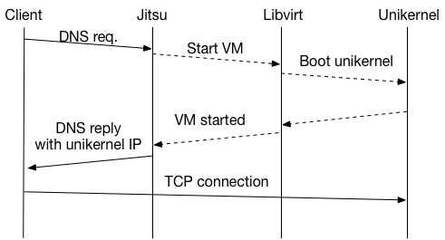

# Just-In-Time Summoning of Unikernels #

*Jitsu is experimental software. See [LICENSE](#license) for conditions.*

Jitsu is a forwarding DNS server that automatically boots [unikernels](http://wiki.xenproject.org/wiki/Unikernels) on demand. When a DNS query is received, Jitsu first checks for a local unikernel that is mapped to the requested domain. If a unikernel is found, the unikernel is started and its IP is returned to the client. Otherwise, the request is forwarded to the next DNS server. If no DNS requests are received for the unikernel within a given timeout period it is automatically stopped. 



This version of Jitsu has been tested with [MirageOS](https://mirage.io) and [Rumprun](https://github.com/rumpkernel/rumprun) unikernels.

Jitsu supports several backends to manage the unikernel VMs. Currently [libvirt](https://libvirt.org), [XAPI](http://wiki.xenproject.org/wiki/XAPI) and [libxenlight](http://wiki.xen.org/wiki/Choice_of_Toolstacks#Libxenlight_.28libxl.29) are supported. Metadata and internal state is stored in [Irmin](https://github.com/mirage/irmin) and the DNS server is implemented on top of [ocaml-dns](https://github.com/mirage/ocaml-dns).

 - Latest release: https://github.com/mirage/jitsu/releases
 - Bugtracker: https://github.com/mirage/jitsu/issues
 - Development version: https://github.com/mirage/jitsu

[](https://travis-ci.org/mirage/jitsu)

#### Overview ####

 - [Installing Jitsu](#installing-jitsu)
 - [Getting started](#getting-started)
 - [Examples](#examples)
    - [MirageOS web server](#mirageos-web-server)
    - [nginx in rumprun](#nginx-in-rumprun)
    - [Linux VMs in Virtualbox](#linux-vms-in-virtualbox)
 - [Command line options](#options)
 - [License](#license)

## Installing Jitsu ##

Jitsu needs the development libraries for Libvirt, Xapi and Xenlight to compile. This can be handled by [`opam`](https://opam.ocaml.org/) in most cases. To install the system dependencies, run

```
$ opam depext xenctrl libvirt xen-api-client
```

The latest release of Jitsu is available in `opam`. To install:

```
$ opam install jitsu
```

To install the latest development version of Jitsu, you can pin Jitsu to the current master branch on Github. This version is *unstable* and changes frequently.

```
$ opam pin add jitsu --dev
$ opam install jitsu
```

If the installation succeeds you should now be able to start Jitsu. If you ran into problems and are using OS X, see below for additional troubleshooting tips.

#### OS X troubleshooting ####
To install the OCaml libvirt bindings on OS X we have to set CPPFLAGS first (due to this [bug](https://github.com/ocaml/opam-repository/issues/2621)). This step can be skipped on other platforms.

```
$ CPPFLAGS="-Wno-error=tautological-compare -Wno-error=unused-function" \
opam install libvirt
```

You should now be able to install Jitsu as usual.

## Getting started ##

Jitsu is initially launched with a list of unikernels, their configurations and a set of parameters that define 

 - how to connect to the virtualization backend
 - how the DNS server should be configured
 - how the unikernels should be managed

A minimal Jitsu configuration could look like this:

```
$ sudo ./jitsu -c xen:/// \
dns=www.openmirage.org,\
ip=192.168.0.22,\
name=mirage-www
```

The command above connects to a local Xen-server (from dom0) through libvirt (the default) and starts the DNS server. Requests for www.openmirage.org will be redirected to the Xen-VM called "mirage-www" with IP 192.168.0.22. If "mirage-www" is not running, Jitsu will start it automatically before responding to the DNS request.

Each unikernel is configured using a set of key/value pairs separated by commas. The parameters that are supported depends on which virtualization backend (libvirt, xapi or libxl) is used to control the unikernels. See [below](#options) or run `./jitsu --help` for a complete set of options.

## Examples ##

### MirageOS web server ###
For this example you need a working MirageOS unikernel with a static IP address and access to dom0 on a Xen server with `libxl` installed. You can also install Xen in Virtualbox, as described [here](http://www.skjegstad.com/blog/2015/01/19/mirageos-xen-virtualbox/) or use one of the [Mirage Vagrant VMs](https://github.com/mirage/mirage-vagrant-vms). An example unikernel that displays the unikernel boot time can be found [here](https://github.com/MagnusS/mirage-stats-demo) (a live version is running [here](http://www.jitsu.v0.no)). Follow the instructions in the README to configure the network settings. After building the unikernel you should have a binary file that can be booted in Xen, usually `mirage-www.xen`. You can also check the generated .xl file and locate the `kernel=` parameter to find the file.

We should now be able to start Jitsu to manage the unikernel:

```
$ sudo jitsu -x libxl \
dns=www.example.org,\
ip=10.0.0.1,\
kernel=mirage-www.xen,\
memory=64000,\
name=www,\
nic=br0
```

This command boots the unikernel when `www.example.org` is resolved. The IP 10.0.0.1 is returned to clients that resolve the domain and the booted unikernel is in `mirage-www.xen`. The VM is given 64MB of memory and access to a network bridge at `br0`. 

If everything worked, Jitsu should now be running a DNS server on localhost. To verify that the domain is automatically started you can run `host` to resolve the domain:

```
host www.example.org 127.0.0.1
Using domain server:
Name: 127.0.0.1
Address: 127.0.0.1#53
Aliases: 

www.example.org has address 10.0.0.1
```

After running `host` you should be able to open the web page on 10.0.0.1 (or telnet to port 80) and ping the IP.

The unikernel is automatically destroyed after the DNS cache entry expires. This timeout can be set with the `--ttl` parameter. See `jitsu --help` for a full list of available parameters and options that can be passed to the `libxl` backend.

### nginx in rumprun ###

[Rumprun unikernels](https://github.com/rumpkernel/wiki/wiki/Tutorial%3A-Getting-Started) can also be managed by Jitsu, but currently only with the `libxl` backend. Prior to running Jitsu, the [rumprun](https://github.com/rumpkernel/rumprun) tool must be used to generate a JSON configuration file that is passed to Jitsu using the `rumprun_config` parameter.

A tutorial for building a unikernel that hosts a static web page in QEMU is available [here](https://github.com/rumpkernel/wiki/wiki/Tutorial%3A-Serve-a-static-website-as-a-Unikernel). To get a Xen unikernel, follow the instructions, but run `rumpbake` with the `xen_pv` parameter instead of `hw_virtio`. After baking the Xen unikernel it must be started once with `rumprun` to obtain the configuration files. To run the Nginx unikernel from the tutorial in Xen you could (depending on your configuration) use a command similar to this:

```
sudo rumprun -T tmp xen -M 64 -i \
    -b images/stubetc.iso,/etc -b images/data.iso,/data \
    -I mynet,xenif,bridge=br0 -W mynet,inet,static,10.0.0.1/24,10.0.1.1 \
    -- nginx.bin -c /data/conf/nginx.conf
```

The command above will boot a rumprun unikernel that mounts two disks (stubetc.iso and data.iso), connect it to the network bridge `br0` and give it the IP 10.0.0.1. The `-T` parameter saves the generated configuration files in the `tmp` directory. You can verify that the unikernel booted correctly by running `sudo xl list`. You can also attach to the console with `sudo xl console [name of unikernel]`. To stop the unikernel, use `sudo xl destroy [name of unikernel]`.

If the unikernel booted correctly we should now be able to use the file `tmp/json.conf` to boot it with Jitsu.

```
jitsu -x libxl dns=www.example.org,\
memory=64000,\
ip=10.0.0.1,\
name=rumprun,\
kernel=nginx.bin,\
disk=images/stubetc.iso@xvda,\
disk=images/data.iso@xvdb,\
nic=br0,\
rumprun_config=tmp/json.cfg 
```

Verify that the unikernel boots in Jitsu by running `host www.example.org 127.0.0.1`. An nginx web server should now be running in a rumprun unikernel on IP 10.0.0.1.

Note that rumprun unikernels currently have to wait for the disk images to be configured by Xen. When the disks are mounted as ISO files (as in this example) the total boot time can be more than a second. An alternative is to use `losetup` to create loopback devices that map to the ISO files. The `-d` parameter can also be used to delay the DNS response to compensate for this. See `jitsu --help` for a full list of available options.

### Linux VMs in Virtualbox ###
Jitsu can be used to control VMs in Virtualbox with libvirt. Note that how well this will work depends on how quickly the VM is able to respond to requests after resuming from suspend (see also the `-d` parameter for how to delay the DNS response).

First, install libvirt and use virsh to display a list of available VMs. Example output:

```
$ virsh list --all
Welcome to virsh, the virtualization interactive terminal.

Type:  'help' for help with commands
       'quit' to quit

virsh # list --all
 Id    Name                           State
----------------------------------------------------
 2     Ubuntu                         running
```

If virsh is unable to connect to Virtualbox, you may have to adjust the connection URI (`-c [uri]`). The default connection URI for Virtualbox is vbox:///session - see [this page](https://libvirt.org/remote.html) for more details. In OS X you may have to set the socket manually, which can be done with 'vbox:///session?socket=path-to-socket'. Remember to use the same connection URI for Jitsu below.

You should now be able to start Jitsu. Use '-m suspend' to set it to suspend the VM on inactivity. Example output:

```
$ sudo ./jitsu dns=www.example.com,ip=127.0.0.1,name=Ubuntu -m suspend -c vbox:///session
Connecting to vbox:///session...
Adding domain 'www.example.com' for VM 'Ubuntu' with ip 127.0.0.1
Adding SOA 'example.com' with ttl=60
Adding A PTR for 'www.example.com' with ttl=60 and ip=127.0.0.1
Starting server on 127.0.0.1:53...
```

To test that Jitsu works, try to resolve the domain with host:

```
$ host www.example.com 127.0.0.1
Using domain server:
Name: 127.0.0.1
Address: 127.0.0.1#53
Aliases:

www.example.com has address 127.0.0.1
```

The domain should now be running.

```
$ virsh dominfo Ubuntu
Id:             2
Name:           Ubuntu
UUID:           6e696eb7-09f4-484c-981b-8d34efa0304d
OS Type:        hvm
State:          running
CPU(s):         3
Max memory:     2147483648 KiB
Used memory:    3166208 KiB
Persistent:     yes
Managed save:   unknown
```

After 2 minutes without DNS requests, Jitsu will suspend the domain automatically. This timeout can be adjusted with the --ttl parameter. Jitsu terminates the VM after 2 x DNS TTL seconds has expired without new requests.

## Options ##
```
    -b ADDR, --bind=ADDR (absent=127.0.0.1)
        Bind local DNS server to interface with this IP

    -c CONNECT, --connect=CONNECT (absent=xen:///)
        Libvirt and Xapi connection string (e.g. xen+ssh://x.x.x.x/system
        or vbox:///session)

    -d SECONDS, --delay=SECONDS (absent=0.1)
        Time to wait in seconds before responding to a DNS query after the
        local VM has started. This delay gives the VM time to open up the
        necessary TCP ports etc. Setting this value too low can result in
        long delays on the first TCP request to the VM.

    -f ADDR, --forwarder=ADDR
        IP address of DNS server queries should be forwarded to if no local
        match is found. Defaults to system default (/etc/resolv.conf) if
        not specified. Set to 0.0.0.0 to disable forwarding.

    --help[=FMT] (default=pager)
        Show this help in format FMT (pager, plain or groff).

    -l PORT, --listen=PORT (absent=53)
        UDP port to listen for DNS queries

    -m MODE, --mode=MODE (absent=destroy)
        How to stop running VMs after timeout. Valid options are suspend,
        destroy and shutdown. Suspended VMs are generally faster to resume,
        but require resources to store state. Note that MirageOS
        suspend/resume is currently not supported on ARM.

    -p PORT, --port=PORT (absent=53)
        UDP port to forward DNS queries to

    --persistdb=path
        Store the Irmin database in the specified path. The default is to
        store the database in memory only. Note that modifying this
        database while Jitsu is running is currently unsupported and may
        crash Jitsu or have other unexpected results.

    --synjitsu=UUID
        UUID of a running Synjitsu compatible unikernel. When specified,
        Jitsu will attempt to connect to a Synjitsu unikernel over Vchan on
        port 'synjitsu' and send notifications with updates on MAC- and
        IP-addresses of booted unikernels. This allows Synjitsu to send
        gratuitous ARP on behalf of booting unikernels and to cache
        incoming SYN packets until they are ready to receive them. This
        feature is experimental and requires a patched MirageOS TCP/IP
        stack.

    -t SECONDS, --ttl=SECONDS (absent=60)
        DNS TTL in seconds. The TTL determines how long the clients may
        cache our DNS response. VMs are terminated after no DNS requests
        have been received for TTL*2 seconds.

    --version
        Show version information.

    -x BACKEND, --backend=BACKEND (absent=libvirt)
        Which backend to use. Currently libvirt, xapi and libxl are
        supported. Xapi and libxl are less tested and should be considered
        experimental.

COMMON CONFIGURATION
    response_delay
        Override default DNS query response delay for this unikernel. See
        also -d.

    wait_for_key
        Wait for this key to appear in Xenstore before responding to the
        DNS query. Sleeps for [response_delay] after the key appears. The
        key should be relative to /local/domain/[domid]/.

    use_synjitsu
        Enable Synjitsu for this domain if not 0 or absent (requires
        Synjitsu support enabled)

LIBVIRT CONFIGURATION
    name
        Name of VM defined in libvirt (ignored if uuid is set)

    uuid
        UUID of VM defined in libvirt (required, but optional if name is
        set)

    dns DNS name (required)

    ip  IP to return in DNS reply (required)

XAPI CONFIGURATION
    name
        Name of VM defined in Xapi (ignored if uuid is set)

    uuid
        UUID of VM defined in Xapi (optional if name is set)

    dns DNS name (required)

    ip  IP to return in DNS reply (required)

LIBXL CONFIGURATION
    name
        Name of created VM (required)

    dns DNS name (required)

    ip  IP to return in DNS reply (required)

    kernel
        VM kernel file name (required)

    memory
        VM memory in bytes (required)

    cmdline
        Extra parameters passed to kernel (optional)

    nic Network device (br0, eth0 etc). Can be set more than once to
        configure multiple NICs (optional)

    script
        Virtual interface (VIF) configuration script. Can be set more than
        once to specify a VIF script per network device (optional)

    disk
        Disk to connect to the Xen VM. Format '[dom0
        device/file]@[hdX/xvdX/sdX etc]'. Can be set more than once to
        configure multiple disks (optional)

    rumprun_config
        Path to file with rumprun unikernel JSON config (optional)
```

## License ##
```
Copyright (c) 2014-2015 Magnus Skjegstad <magnus@skjegstad.com> and contributors.

Permission to use, copy, modify, and distribute this software for any
purpose with or without fee is hereby granted, provided that the above
copyright notice and this permission notice appear in all copies.

THE SOFTWARE IS PROVIDED "AS IS" AND THE AUTHOR DISCLAIMS ALL WARRANTIES
WITH REGARD TO THIS SOFTWARE INCLUDING ALL IMPLIED WARRANTIES OF
MERCHANTABILITY AND FITNESS. IN NO EVENT SHALL THE AUTHOR BE LIABLE FOR
ANY SPECIAL, DIRECT, INDIRECT, OR CONSEQUENTIAL DAMAGES OR ANY DAMAGES
WHATSOEVER RESULTING FROM LOSS OF USE, DATA OR PROFITS, WHETHER IN AN
ACTION OF CONTRACT, NEGLIGENCE OR OTHER TORTIOUS ACTION, ARISING OUT OF
OR IN CONNECTION WITH THE USE OR PERFORMANCE OF THIS SOFTWARE.
```
